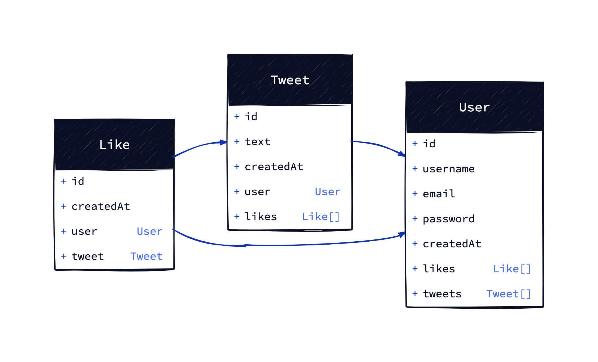

# nomadcoder-react-study-4th_Schema

nomadcoder-react-study-4th_Schema Practice

# Requirements

-   On this assignment we are going to model the Prisma Schema of our graduation project: a fullstack Twitter Clone.
-   Your job today is to translate the following UML class diagram into Prisma models.
-   UML diagrams is how we design and plan the structures of a system and how they are related to each other.

